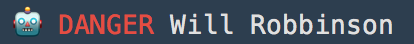

# ansi-parse

> Parse ansi into an array of ansi-tags and text-chunks.

[](https://travis-ci.org/F1LT3R/ansi-parse)
[](https://coveralls.io/github/F1LT3R/ansi-parse?branch=master)
[](https://www.npmjs.com/package/ansi-parse)
[](https://github.com/sindresorhus/xo)

ANSI-Parse takes ANSI strings as input:

```plain
const text = "🤖\u001B[31m DANGER\u001B[0m Will Robbinson"
console.log(text)
```




ANSI-Parse outputs a object representation:

```js
const ansiParse = require('ansi-parse')
const parsed = ansiParse(text)
console.log(parsed)
```

```js
[{
    type: 'text',
    value: '🤖',
    position: {x: 0, y: 0, n: 0, raw: 0},
    style: {}
}, {
    type: 'ansi',
    value: {tag: 'red', ansi: '\u001b[31m'},
    position: {x: 2, y: 0, n: 2, raw: 2}
}, {
    type: 'text',
    value: ' DANGER',
    position: {x: 2,y: 0,n: 2, raw: 7},
    style: {
        foregroundColor: 'red'
    }
}, {
    type: 'ansi',
    value: {tag: 'reset', ansi: '\u001b[0m'},
    position: {x: 9, y: 0, n: 9, raw: 14}
}, {
    type: 'text',
    value: ' Will Robbinson',
    position: {x: 9, y: 0, n: 9, raw: 18},
    style: {}
}]
```

## About Chunks

Each object in the output array is called a "chunk". Each chunk represents one of the following types of data.

1. `ansi` - ANSI escape sequence
1. `newline` - Newline character
1. `text` - Text chunk of like-styles

## Position

```js
{x: 2, y: 0, n: 2, raw: 2}
```

The position object contains 4 kinds of position:

1. `x` - Plain-text column at which the chunk starts
1. `y` - Plain-text crow at which the chunk starts
1. `n` - Linear, 1-dimensional plain-text position at which the chunk starts.
1. `raw` - Linear 1-dimensional position at which the chunk starts for ANSI or plain-text. This is the real JavaScript position string position of the chunk.

## Value

### Text Value

The value of a `text` chunk is a JavaScript string. The value of a etxt chunk should never contain any ANSI escape sequences.

```js
{
    type: 'text',
    value: ' DANGER',
}
```

### ANSI Value

The value of an `ansi` chunk is an object. 

- `value.tag` - Friendly-named ansi-tag.
- `value.ansi` - Raw ANSI string value.

```js
{
    type: 'ansi',
    value: {
        tag: 'red',
        ansi: '\u001b[31m'
    }
}
```

You can find the list ansi-tags in [types/types.ansi-seqs-to-ansi-tags.js](types/types.ansi-seqs-to-ansi-tags.js).

## Install

```
$ yarn add ansi-parse
```

